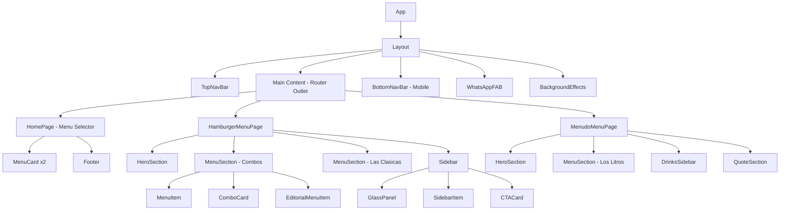
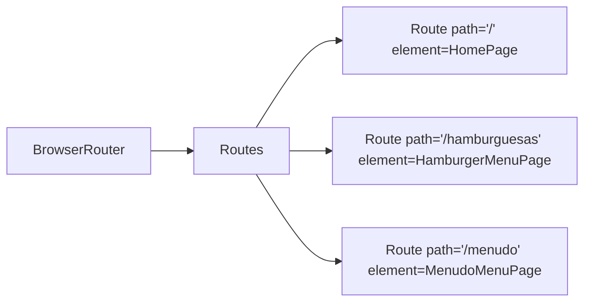

# VAMM Menu Website - React Conversion Technical Plan

## Executive Summary

This document outlines the technical plan for converting the VAMM static HTML menu website into a modern React application. The project consists of three pages: a menu selector (home), a hamburger menu page, and a menudo menu page. The design follows "The Ember & Ash Editorial" design system with a premium, dark, fire-themed aesthetic.

---

## 1. Project Analysis Summary

### 1.1 Existing Pages

| Page | Source Folder | Purpose |
|------|---------------|---------|
| Menu Selector | `vamm_selector_de_men/` | Landing page with two menu options - Menudo for mornings and Hamburgers for afternoons |
| Hamburger Menu | `vamm_hamburguesas_a_la_parrilla_v2/` | Full menu page for hamburgers with combos, individual items, sides, and drinks |
| Menudo Menu | `vamm_menudo_casero/` | Menu page for menudo with liter options and drinks |

### 1.2 Design System Key Points (from DESIGN.md)

- **Theme**: "The Culinary Hearth" - premium, wood-fired kitchen at midnight
- **Colors**: Deep black foundation (`#0e0e0e`), golden glow (`#ffd16c`, `#fdc003`), ember oranges (`#ff743b`, `#ffac54`)
- **Typography**: Epilogue for headlines, Work Sans for body text
- **No-Line Rule**: No 1px borders - use background shifts, negative space, and atmospheric breaks
- **Glassmorphism**: 40% opacity with 12-16px backdrop blur for floating elements
- **Asymmetric Layout**: Editorial-style staggered layouts, not standard grids

---

## 2. Component Architecture

### 2.1 Component Hierarchy Diagram



### 2.2 Core Components Breakdown

#### Layout Components

| Component | Description | Reusability |
|-----------|-------------|-------------|
| `Layout` | Main wrapper with nav, content area, and floating elements | Global |
| `TopNavBar` | Fixed top navigation with logo and links | Global |
| `BottomNavBar` | Mobile-only bottom navigation | Global |
| `WhatsAppFAB` | Floating WhatsApp contact button | Global |
| `BackgroundEffects` | Ambient blur effects for atmosphere | Global |
| `Footer` | Minimal editorial footer | Home page only |

#### Page Components

| Component | Route | Description |
|-----------|-------|-------------|
| `HomePage` | `/` | Menu selector with two large cards |
| `HamburgerMenuPage` | `/hamburguesas` | Full hamburger menu |
| `MenudoMenuPage` | `/menudo` | Full menudo menu |

#### Shared UI Components

| Component | Props | Usage |
|-----------|-------|-------|
| `HeroSection` | `image`, `title`, `subtitle`, `badge` | Both menu pages |
| `SectionDivider` | `title` | Section headers with decorative lines |
| `GlassPanel` | `children`, `icon` | Sidebar containers |
| `MenuCard` | `image`, `title`, `badge`, `linkText`, `href`, `variant` | Home page selection cards |
| `ComboCard` | `image`, `title`, `price`, `description` | Combo items with images |
| `MenuItem` | `title`, `price`, `description`, `tags` | Standard menu items |
| `EditorialMenuItem` | `image`, `title`, `price`, `description`, `alignment` | Alternating layout items |
| `SidebarItem` | `title`, `subtitle`, `price` | Side dishes and drinks |
| `CTACard` | `title`, `description`, `icon`, `info` | Call-to-action cards |
| `QuoteSection` | `quote` | Editorial quote display |
| `Badge` | `text`, `variant` | Category/tag badges |
| `PriceTag` | `amount` | Styled price display |

---

## 3. Routing Strategy

### 3.1 Route Configuration

```
/                    → HomePage (Menu Selector)
/hamburguesas        → HamburgerMenuPage
/menudo              → MenudoMenuPage
```

### 3.2 Implementation Approach

**Recommended: React Router v6**



**Key Considerations:**
- Use `<Link>` components for internal navigation
- Implement scroll-to-top on route change
- Consider lazy loading for menu pages to improve initial load

---

## 4. Styling Approach

### 4.1 Recommended: Tailwind CSS

The existing HTML already uses Tailwind CSS extensively. Maintaining this approach provides:
- Consistency with existing design
- Rapid development
- Built-in responsive utilities
- Easy dark mode support

### 4.2 Tailwind Configuration

```javascript
// tailwind.config.js
module.exports = {
  darkMode: 'class',
  content: ['./src/**/*.{js,jsx,ts,tsx}'],
  theme: {
    extend: {
      colors: {
        // Foundation
        'background': '#0e0e0e',
        'surface': '#0e0e0e',
        'surface-dim': '#0e0e0e',
        'surface-container': '#1a1a1a',
        'surface-container-low': '#131313',
        'surface-container-high': '#20201f',
        'surface-container-highest': '#262626',
        'surface-bright': '#2c2c2c',
        'surface-variant': '#262626',
        
        // Primary - The Glow
        'primary': '#ffd16c',
        'primary-fixed': '#fdc003',
        'primary-container': '#fdc003',
        'primary-dim': '#ecb200',
        'on-primary': '#604700',
        'on-primary-fixed': '#3d2b00',
        
        // Secondary - The Ember
        'secondary': '#ff743b',
        'secondary-container': '#a83900',
        'secondary-dim': '#ff743b',
        'on-secondary': '#3f1000',
        
        // Tertiary
        'tertiary': '#ffac54',
        'tertiary-container': '#ff9800',
        
        // Text
        'on-surface': '#ffffff',
        'on-surface-variant': '#adaaaa',
        'on-background': '#ffffff',
        
        // Outline
        'outline': '#767575',
        'outline-variant': '#484847',
        
        // Error
        'error': '#ff7351',
        'error-container': '#b92902',
      },
      fontFamily: {
        'headline': ['Epilogue', 'sans-serif'],
        'body': ['Work Sans', 'sans-serif'],
        'label': ['Work Sans', 'sans-serif'],
      },
      borderRadius: {
        'DEFAULT': '0.125rem',
        'lg': '0.25rem',
        'xl': '0.5rem',
        'full': '0.75rem',
      },
    },
  },
  plugins: [
    require('@tailwindcss/forms'),
    require('@tailwindcss/container-queries'),
  ],
}
```

### 4.3 Custom CSS Classes

Create a `globals.css` file with custom utility classes:

```css
/* Smoke/Steam Overlays */
.smoke-overlay {
  background: linear-gradient(to bottom, transparent, #0e0e0e 95%),
              radial-gradient(circle at 50% 50%, rgba(255, 116, 59, 0.05), transparent 70%);
}

.steam-effect {
  mask-image: linear-gradient(to top, black 20%, transparent 100%);
  -webkit-mask-image: linear-gradient(to top, black 20%, transparent 100%);
}

/* Text Effects */
.text-gradient-ember {
  background: linear-gradient(to right, #ffd16c, #ff743b);
  -webkit-background-clip: text;
  -webkit-text-fill-color: transparent;
}

.text-glow {
  text-shadow: 0 0 15px rgba(253, 192, 3, 0.4);
}

.ember-gradient {
  background: linear-gradient(135deg, #ffd16c 0%, #ff743b 100%);
  -webkit-background-clip: text;
  -webkit-text-fill-color: transparent;
}

/* Glass Panel */
.glass-panel {
  background: rgba(38, 38, 38, 0.4);
  backdrop-filter: blur(12px);
  border: 1px solid rgba(72, 72, 71, 0.15);
}

/* Material Icons */
.material-symbols-outlined {
  font-variation-settings: 'FILL' 0, 'wght' 400, 'GRAD' 0, 'opsz' 24;
}
```

---

## 5. Project Structure

```
vamm-menu-react/
├── public/
│   ├── index.html
│   ├── favicon.ico
│   └── assets/
│       └── images/
│           ├── hamb.jpeg
│           ├── hamb2.jpeg
│           ├── menu.jpeg
│           ├── menu2.jpeg
│           ├── menudo.jpeg
│           └── packed-menudo.jpeg
│
├── src/
│   ├── index.tsx
│   ├── App.tsx
│   │
│   ├── components/
│   │   ├── layout/
│   │   │   ├── Layout.tsx
│   │   │   ├── TopNavBar.tsx
│   │   │   ├── BottomNavBar.tsx
│   │   │   ├── Footer.tsx
│   │   │   └── BackgroundEffects.tsx
│   │   │
│   │   ├── common/
│   │   │   ├── WhatsAppFAB.tsx
│   │   │   ├── Badge.tsx
│   │   │   ├── PriceTag.tsx
│   │   │   ├── SectionDivider.tsx
│   │   │   └── GlassPanel.tsx
│   │   │
│   │   ├── menu/
│   │   │   ├── HeroSection.tsx
│   │   │   ├── MenuCard.tsx
│   │   │   ├── ComboCard.tsx
│   │   │   ├── MenuItem.tsx
│   │   │   ├── EditorialMenuItem.tsx
│   │   │   ├── SidebarItem.tsx
│   │   │   └── CTACard.tsx
│   │   │
│   │   └── sections/
│   │       ├── QuoteSection.tsx
│   │       └── MenuSection.tsx
│   │
│   ├── pages/
│   │   ├── HomePage.tsx
│   │   ├── HamburgerMenuPage.tsx
│   │   └── MenudoMenuPage.tsx
│   │
│   ├── data/
│   │   ├── hamburgerMenu.ts
│   │   ├── menudoMenu.ts
│   │   └── navigation.ts
│   │
│   ├── styles/
│   │   └── globals.css
│   │
│   ├── hooks/
│   │   └── useScrollToTop.ts
│   │
│   └── types/
│       └── menu.ts
│
├── tailwind.config.js
├── postcss.config.js
├── tsconfig.json
├── package.json
└── README.md
```

---

## 6. Reusable Components Detail

### 6.1 Layout Components

#### TopNavBar
```typescript
interface TopNavBarProps {
  currentPage?: 'home' | 'hamburguesas' | 'menudo';
  showBackButton?: boolean;
}
```
- Fixed position with blur background
- Logo on left, navigation links center/right
- Mobile hamburger menu icon
- Back arrow button on right

#### BottomNavBar
```typescript
// No props - uses current route for active state
```
- Mobile only (hidden on md+)
- Four navigation items: Home, Menu, Orders, Contact
- Active state with primary background

#### WhatsAppFAB
```typescript
interface WhatsAppFABProps {
  phoneNumber: string;
  showText?: boolean;
  text?: string;
}
```
- Fixed bottom-right position
- Animated pulse effect
- Responsive text visibility

### 6.2 Menu Components

#### HeroSection
```typescript
interface HeroSectionProps {
  backgroundImage: string;
  title: string;
  subtitle?: string;
  badge?: {
    text: string;
    variant: 'primary' | 'secondary';
  };
  height?: 'tall' | 'medium';
  overlayType?: 'smoke' | 'steam';
}
```

#### MenuCard (Home Page)
```typescript
interface MenuCardProps {
  image: string;
  imageAlt: string;
  badge: string;
  title: string;
  linkText: string;
  href: string;
  variant: 'primary' | 'secondary';
  offset?: boolean; // For asymmetric layout
}
```

#### ComboCard
```typescript
interface ComboCardProps {
  image: string;
  imageAlt: string;
  title: string;
  price: number;
  description: string;
}
```

#### EditorialMenuItem
```typescript
interface EditorialMenuItemProps {
  image: string;
  imageAlt: string;
  title: string;
  price: number;
  description: string;
  alignment: 'left' | 'right';
}
```

#### MenuItem
```typescript
interface MenuItemProps {
  title: string;
  price: number;
  description: string;
  tags?: Array<{
    text: string;
    variant: 'primary' | 'secondary';
  }>;
  icon?: string;
}
```

#### SidebarItem
```typescript
interface SidebarItemProps {
  title: string;
  subtitle?: string;
  price: number;
  showDottedLine?: boolean;
}
```

---

## 7. Data Structure

### 7.1 Menu Item Types

```typescript
// types/menu.ts

export interface MenuItem {
  id: string;
  name: string;
  price: number;
  description: string;
  image?: string;
  tags?: string[];
  category: string;
}

export interface MenuCategory {
  id: string;
  name: string;
  items: MenuItem[];
}

export interface MenuPage {
  id: string;
  title: string;
  subtitle?: string;
  heroImage: string;
  badge?: string;
  categories: MenuCategory[];
  sidebar?: {
    accompaniments?: MenuItem[];
    drinks?: MenuItem[];
    cta?: {
      title: string;
      description: string;
      info: string;
    };
  };
  quote?: string;
}
```

### 7.2 Sample Data File

```typescript
// data/hamburgerMenu.ts

export const hamburgerMenu: MenuPage = {
  id: 'hamburguesas',
  title: 'HAMBURGUESAS A LA PARRILLA',
  heroImage: '/assets/images/hamb.jpeg',
  categories: [
    {
      id: 'combos',
      name: 'COMBOS',
      items: [
        {
          id: 'combo-papas-soda',
          name: 'Combo c/ papas y soda',
          price: 150,
          description: 'Nuestra hamburguesa clásica acompañada de papas fritas crujientes y tu soda favorita.',
          image: '/assets/images/combo1.jpeg',
          category: 'combos'
        },
        // ... more items
      ]
    },
    {
      id: 'clasicas',
      name: 'LAS CLÁSICAS',
      items: [
        {
          id: 'hamburguesa-sencilla',
          name: 'HAMBURGUESA SENCILLA',
          price: 100,
          description: 'Carne de res artesanal 100% selecta, forjada a la parrilla...',
          image: '/assets/images/burger-simple.jpeg',
          category: 'clasicas'
        },
        // ... more items
      ]
    }
  ],
  sidebar: {
    accompaniments: [
      { id: 'papas', name: 'Papas a la francesa', price: 40, description: 'Corte clásico, sal de mar', category: 'sides' }
    ],
    drinks: [
      { id: 'coca', name: 'Coca-Cola', price: 30, description: '', category: 'drinks' },
      { id: 'mountain-dew', name: 'Mountain Dew', price: 35, description: '', category: 'drinks' }
    ],
    cta: {
      title: '¿HAMBRE?',
      description: 'Pide ahora y recibe el sabor de la parrilla en tu puerta.',
      info: 'Abiertos hasta las 11:00 PM'
    }
  }
};
```

---

## 8. Implementation Checklist

### Phase 1: Project Setup
- [ ] Initialize React project with TypeScript (Vite or Create React App)
- [ ] Install dependencies (react-router-dom, tailwindcss, postcss, autoprefixer)
- [ ] Configure Tailwind CSS with custom theme
- [ ] Set up project folder structure
- [ ] Add Google Fonts (Epilogue, Work Sans, Material Symbols)
- [ ] Copy image assets to public folder

### Phase 2: Core Components
- [ ] Create Layout component with routing structure
- [ ] Build TopNavBar component
- [ ] Build BottomNavBar component (mobile)
- [ ] Create WhatsAppFAB component
- [ ] Implement BackgroundEffects component

### Phase 3: Shared UI Components
- [ ] Create Badge component
- [ ] Create PriceTag component
- [ ] Create SectionDivider component
- [ ] Create GlassPanel component
- [ ] Create HeroSection component

### Phase 4: Menu Components
- [ ] Build MenuCard component (home page cards)
- [ ] Build ComboCard component
- [ ] Build MenuItem component
- [ ] Build EditorialMenuItem component
- [ ] Build SidebarItem component
- [ ] Build CTACard component
- [ ] Build QuoteSection component

### Phase 5: Pages
- [ ] Implement HomePage (Menu Selector)
- [ ] Implement HamburgerMenuPage
- [ ] Implement MenudoMenuPage

### Phase 6: Data & Integration
- [ ] Create TypeScript types for menu data
- [ ] Create data files for hamburger menu
- [ ] Create data files for menudo menu
- [ ] Wire up components with data

### Phase 7: Polish & Testing
- [ ] Test responsive design on all breakpoints
- [ ] Verify all hover/active states
- [ ] Test navigation and routing
- [ ] Optimize images
- [ ] Add loading states if needed
- [ ] Cross-browser testing

---

## 9. Technical Recommendations

### 9.1 Build Tool
**Recommended: Vite**
- Faster development server
- Better TypeScript support
- Optimized production builds

### 9.2 Dependencies

```json
{
  "dependencies": {
    "react": "^18.2.0",
    "react-dom": "^18.2.0",
    "react-router-dom": "^6.x"
  },
  "devDependencies": {
    "@types/react": "^18.2.0",
    "@types/react-dom": "^18.2.0",
    "typescript": "^5.x",
    "tailwindcss": "^3.x",
    "postcss": "^8.x",
    "autoprefixer": "^10.x",
    "@tailwindcss/forms": "^0.5.x",
    "@tailwindcss/container-queries": "^0.1.x",
    "vite": "^5.x",
    "@vitejs/plugin-react": "^4.x"
  }
}
```

### 9.3 Image Optimization
- Use WebP format for better compression
- Implement lazy loading for below-fold images
- Consider using `srcset` for responsive images

### 9.4 Accessibility Considerations
- Ensure 4.5:1 contrast ratio for body text
- Add proper ARIA labels to navigation
- Implement keyboard navigation
- Add alt text to all images

---

## 10. Visual Reference Summary

### Home Page (Menu Selector)
- Full-height hero area with two large cards
- Asymmetric layout (second card offset down)
- Smoke overlay on images
- Floating WhatsApp button
- Minimal footer

### Hamburger Menu Page
- Large hero image with smoke overlay
- Gradient text title
- Two-column layout: main content (8 cols) + sidebar (4 cols)
- Combos section with image cards
- Editorial-style alternating layout for individual items
- Glass panel sidebar with sides, drinks, and CTA

### Menudo Menu Page
- Hero with steam effect
- Badge for "Especialidad Matutina"
- Menu items in card format with tags
- Sidebar with drinks and quote
- Editorial quote section at bottom

---

## Appendix: Component Visual Mapping

| Screenshot Element | Component Name | Notes |
|-------------------|----------------|-------|
| VAMM logo | Part of TopNavBar | Golden text, tracking-widest |
| Navigation links | TopNavBar | Active state with underline |
| Large menu cards | MenuCard | With smoke overlay and hover scale |
| Hero image section | HeroSection | With gradient overlay |
| Section headers | SectionDivider | Lines on both sides |
| Combo cards | ComboCard | Image + text below |
| Circular burger images | EditorialMenuItem | Alternating left/right |
| Glass sidebar panels | GlassPanel + SidebarItem | Blur effect |
| Yellow CTA box | CTACard | Primary background |
| WhatsApp button | WhatsAppFAB | Fixed position, pulse animation |
| Bottom nav | BottomNavBar | Mobile only, rounded top |
| Quote section | QuoteSection | Italic, centered |
| Footer | Footer | Minimal, low opacity |
